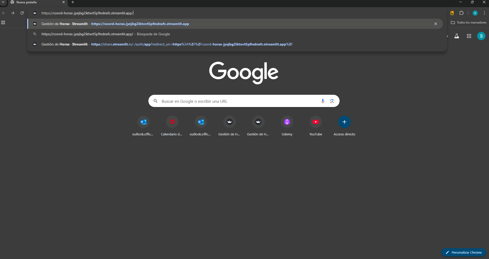
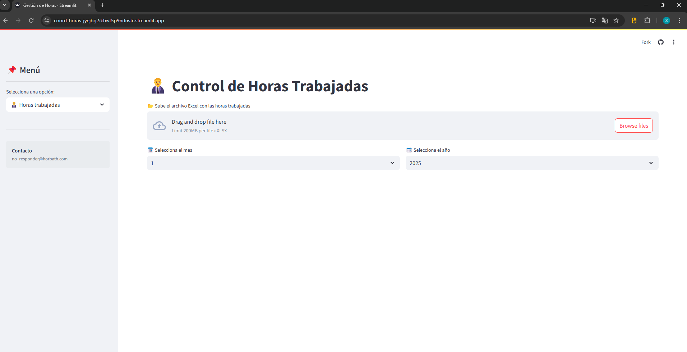
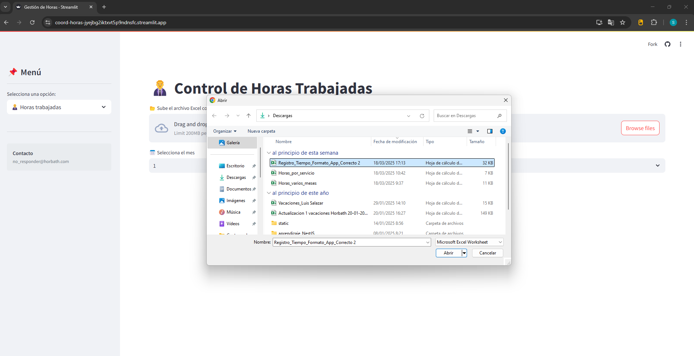
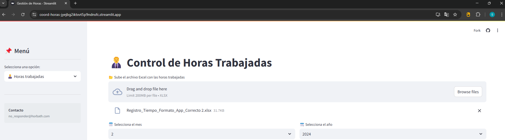
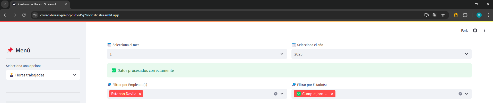
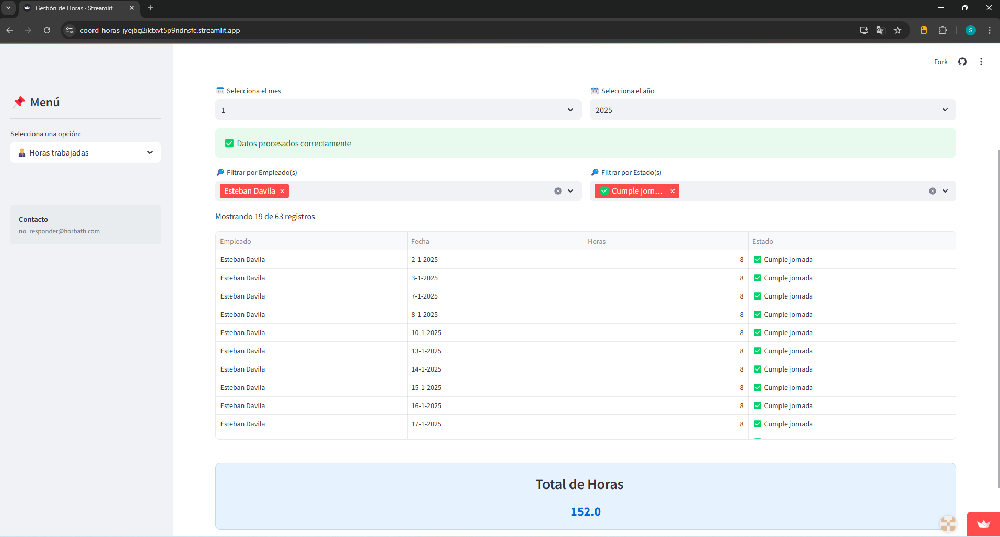
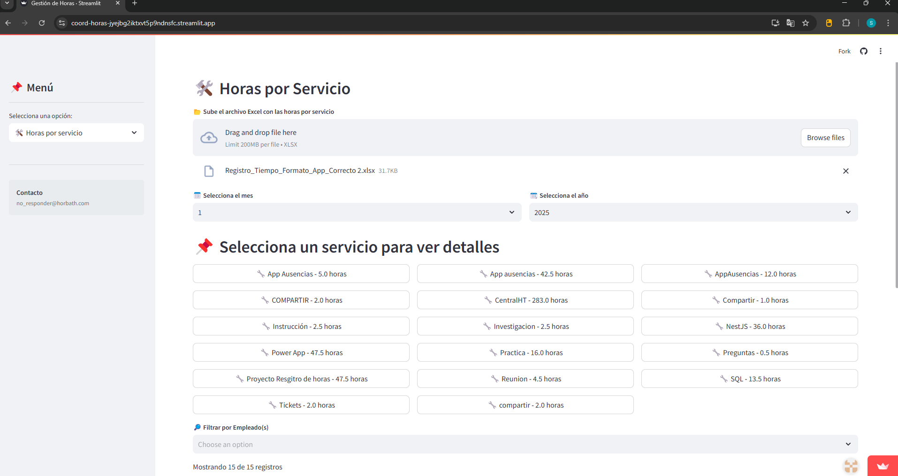
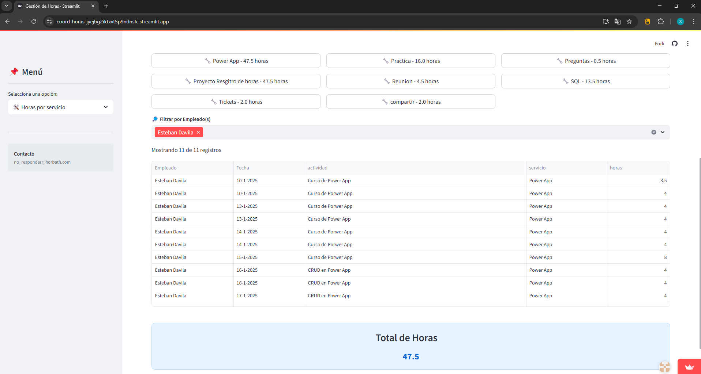

# 🕑 Control de Horas

Esta aplicación web interactiva permite gestionar y analizar las horas trabajadas por empleados en diferentes servicios, utilizando un archivo Excel como fuente de datos. La aplicación ofrece dos funcionalidades principales:  

1. **Análisis de las horas trabajadas por empleado.**
2. **Análisis de las horas trabajadas por servicio.**

# ✅ Requisitos

* Un **navegador web** moderno (Google Chrome, Mozilla Firefox, etc.).
* Un **archivo de Excel** (.xlsx) con los registros de horas trabajadas, con el formato correcto.
* **Conexión a Internet** para acceder a la aplicación web.

## 🌐 Uso

1. **Acceder a la aplicación:**
   - Abre tu navegador web y navega a la URL:  
     [https://coord-horas-jyejbg2iktxvt5p9ndnsfc.streamlit.app/](https://coord-horas-jyejbg2iktxvt5p9ndnsfc.streamlit.app/).

   

2. **Subir el archivo de Excel:**
   - En la página principal, haz clic en el botón **"Browse files"** para cargar el archivo .xlsx que contiene los registros de horas trabajadas de tus empleados.
   
   
   
   - Selecciona el archivo desde tu computadora y haz clic en **"Abrir"**. El archivo se cargará y se mostrará una vista previa en la aplicación.
   - El archivo debe tener el formato correcto para que la aplicación pueda procesarlo adecuadamente.

   

3. **Seleccionar mes y año:**
   - Una vez cargado el archivo, selecciona el **mes** y el **año** correspondientes para los cuales deseas generar el reporte de horas trabajadas.

   

4. **Aplicar filtros (opcional):**
   - Puedes aplicar filtros para ver los datos de empleados específicos o por estado de la jornada (ej. "Cumple jornada", "No cumple jornada", "Excede jornada").

   
   
5. **Ver los resultados:**
   - Los datos filtrados se mostrarán en una tabla con detalles sobre las horas trabajadas por empleado. Además, se calculará automáticamente el total de horas trabajadas para los empleados seleccionados.

   

6. **Ver análisis por servicio (opcional):**
   - Si necesitas ver las horas trabajadas por servicio, selecciona la opción correspondiente en el menú lateral. Aquí podrás cargar otro archivo de Excel con los registros de horas trabajadas por servicio y realizar los mismos pasos de filtrado y visualización.

   

   

    